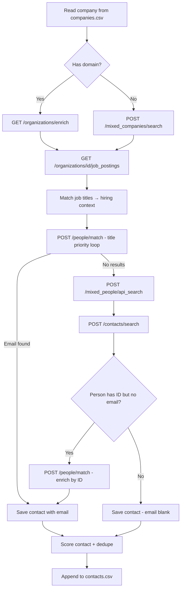

# SDE Job Outreach Automation

A lightweight, **local-first** web app for Software Engineering job search outreach. Upload a list of target companies, discover recruiters and hiring managers via the **Apollo API**, review every contact manually, and send thoughtful template-based emails from your personal **Gmail** account.

> **Personal use only.** Not built for mass emailing, CRM workflows, or multi-user deployment.

---

## Table of Contents

1. [Philosophy](#philosophy)
2. [What This Tool Does](#what-this-tool-does)
3. [Features](#features)
4. [Tech Stack](#tech-stack)
5. [Prerequisites](#prerequisites)
6. [Installation](#installation)
7. [Environment Variables](#environment-variables)
8. [End-to-End Workflow](#end-to-end-workflow)
9. [CSV Schemas](#csv-schemas)
10. [Apollo API Reference](#apollo-api-reference)
11. [Discovery Pipeline](#discovery-pipeline)
12. [Contact Scoring](#contact-scoring)
13. [Email Template](#email-template)
14. [Application Pages & API Routes](#application-pages--api-routes)
15. [CLI Scripts](#cli-scripts)
16. [Gmail Setup](#gmail-setup)
17. [Apollo Account Setup](#apollo-account-setup)
18. [Free Plan vs Paid Plan](#free-plan-vs-paid-plan)
19. [Troubleshooting](#troubleshooting)
20. [Project Structure](#project-structure)
21. [Scripts Reference](#scripts-reference)
22. [Out of Scope](#out-of-scope)
23. [License](#license)

---

## Philosophy

The goal is **not** to blast hundreds of emails.

The goal is to:

- Find the **right people** at target companies (recruiters, EMs, hiring managers)
- **Review every contact** before anything is sent
- Send **high-quality, template-based** outreach referencing real open roles
- **Track progress** in simple CSV files on your machine

Simplicity over automation. Human judgment at every step.

---

## What This Tool Does

```
companies.csv  →  Apollo API (org enrich, job postings, people match)  →  contacts.csv
                                                                              ↓
                                                                    Manual review (required)
                                                                              ↓
                                                         Gmail SMTP (Nodemailer) → SENT status
```

| Stage | Input | Output |
| ----- | ----- | ------ |
| **Upload** | `companies.csv` | Target company list stored in `data/` |
| **Company Intel** | Companies + domains | `company_intel.csv` — hiring scores, open SDE/backend/MLE roles |
| **Discover** | Companies | `contacts.csv` — recruiters, managers, emails (when Apollo returns them) |
| **Review** | `contacts.csv` | Curated list with `send_email` / `special_mail` flags |
| **Send** | Approved contacts | Emails sent via Gmail; status updated to `SENT` / `FAILED` |

---

## Features

| Feature | Description |
| -------- | ----------- |
| **Company list** | Upload `companies.csv` with company name and domain |
| **Company intel** | Apollo org enrich + job postings → hiring score per company |
| **Apollo discovery** | Find recruiters, EMs, hiring managers, and team leads per company |
| **People match (primary)** | `POST /people/match` with title priority — works on free Apollo plan |
| **People search (fallback)** | `POST /mixed_people/api_search` — requires paid Apollo API access |
| **Contact scoring** | Ranks contacts by role relevance, email quality, and open job matches |
| **Contact export** | Save results to `contacts.csv`; email when Apollo provides it, blank otherwise |
| **Manual review** | Edit contacts, add emails, remove duplicates, add notes |
| **Send selection** | Mark `send_email` / `special_mail` per contact |
| **Email preview** | Review subject and body before sending |
| **Gmail sending** | Send via Nodemailer + Gmail App Password (1.5s delay between sends) |
| **Status tracking** | `PENDING` · `SENT` · `FAILED` · `SKIPPED` |
| **Credit budgeting** | Stops discovery when `APOLLO_CREDIT_LIMIT` is reached (default 75/month) |

**Intentionally excluded:** database, authentication, cloud deployment, AI personalization, Hunter.io, LinkedIn scraping.

---

## Tech Stack

| Layer | Technology |
| ----- | ---------- |
| Frontend | Next.js 15, React 19, TypeScript, Tailwind CSS |
| Integrations | Apollo API (`X-Api-Key` header), Gmail SMTP (Nodemailer) |
| Storage | CSV files in `data/` (gitignored) |
| Runtime | Local machine only (`localhost:3000`) |

---

## Prerequisites

| Requirement | Notes |
| ----------- | ----- |
| **Node.js 18+** | Required for Next.js 15 |
| **Apollo account** | [apollo.io](https://www.apollo.io/) with API key ([Settings → Integrations → API Keys](https://app.apollo.io/#/settings/integrations/api)) |
| **Gmail account** | With [2-Step Verification](https://myaccount.google.com/security) and an [App Password](https://myaccount.google.com/apppasswords) |
| **Target companies** | A list of companies you want to reach out to |

---

## Installation

```bash
# 1. Clone the repository
git clone <your-repo-url>
cd apollo_leads

# 2. Install dependencies
npm install

# 3. Configure environment
cp .env.example .env
# Edit .env with your API keys (see Environment Variables below)

# 4. Start the development server
npm run dev
```

Open [http://localhost:3000](http://localhost:3000) in your browser.

### Production build

```bash
npm run build
npm start
```

### Verify Apollo access before using the app

```bash
npm run test:apollo -- --company CoinDCX --domain coindcx.com
```

This probes all Apollo endpoints the app uses and prints a verdict on what works with your plan.

---

## Environment Variables

Copy `.env.example` to `.env` and fill in all values:

```env
APOLLO_API_KEY=your_apollo_master_api_key
GMAIL_EMAIL=your@gmail.com
GMAIL_APP_PASSWORD=your_16_char_app_password
LINKEDIN_URL=https://linkedin.com/in/yourprofile
GITHUB_URL=https://github.com/yourusername

# Optional — defaults to 75
APOLLO_CREDIT_LIMIT=75
```

| Variable | Required | Purpose |
| -------- | -------- | ------- |
| `APOLLO_API_KEY` | Yes | Apollo API authentication (passed as `X-Api-Key` header) |
| `GMAIL_EMAIL` | Yes | Sender address for outreach emails |
| `GMAIL_APP_PASSWORD` | Yes | Gmail SMTP auth — **not** your regular Google password |
| `LINKEDIN_URL` | Yes | Injected into email template as `{{linkedin}}` |
| `GITHUB_URL` | Yes | Injected into email template as `{{github}}` |
| `APOLLO_CREDIT_LIMIT` | No | Max Apollo credits to spend per discovery run (default: `75`) |

**Security:** Never commit `.env`. CSV data in `data/` is gitignored by default.

---

## End-to-End Workflow

### Overview

```
┌─────────────────┐     ┌──────────────────┐     ┌─────────────────┐
│ 1. Upload       │     │ 2. Discover      │     │ 3. Review       │
│ companies.csv   │ ──► │ Contacts (Apollo)│ ──► │ contacts.csv    │
└─────────────────┘     └──────────────────┘     └────────┬────────┘
                                                          │
                        ┌──────────────────┐              │
                        │ 4. Send Emails   │ ◄────────────┘
                        │ (Gmail SMTP)     │
                        └──────────────────┘
```

Follow these four steps in order via the sidebar: **Dashboard → Discover → Review → Send**.

---

### Step 1 — Upload Companies (Dashboard `/`)

1. Create a `companies.csv` file:

```csv
company_name,domain
Groww,groww.in
Razorpay,razorpay.com
PhonePe,phonepe.com
CoinDCX,coindcx.com
```

| Column | Required | Description |
| ------ | -------- | ----------- |
| `company_name` | Yes | Display name of the target company |
| `domain` | **Strongly recommended** | Company website domain (e.g. `razorpay.com`). Required for Company Intel and improves Apollo org resolution |

> **Tip:** The `domain` column is critical on Apollo's free plan. Without it, org enrichment and `people/match` are less reliable.

2. On the **Dashboard**, click **Upload companies.csv** and select your file.
3. Confirm the pipeline shows your company count under **Companies → in scope**.

**Alternative:** Place the file directly at `data/companies.csv`. The app reads it fresh on every discovery run.

**Simple format (name only):** A single-column CSV with just `company_name` also works, but domain-less rows limit Apollo matching:

```csv
company_name
Groww
Razorpay
```

---

### Step 2 — Discover Contacts & Company Intel (Discover `/recruiters`)

This page has two automated actions and displays Apollo API status.

#### 2a. Run Company Intel (works on free Apollo plan)

1. Ensure every company in `companies.csv` has a `domain` column.
2. Click **Run Company Intel**.
3. Results are saved to `data/company_intel.csv` and displayed in the **Company Intel Queue** table.

Company Intel calls:

- `GET /organizations/enrich` — company metadata (industry, employee count, org ID)
- `GET /organizations/{org_id}/job_postings` — open job titles

Each company gets a **hiring score** based on whether SDE, backend, or MLE roles are open. Use this table to **prioritize** which companies to pursue first.

#### 2b. Run People Discovery (requires Apollo API access)

1. Click **Run People Discovery**.
2. The app processes each company in `companies.csv` sequentially.
3. Results are merged into `data/contacts.csv` (append by default; check **Replace existing contacts** to overwrite).
4. Review the progress table, warnings, and credit usage.

**What gets discovered per company:**

| Role category | Example titles searched |
| ------------- | ----------------------- |
| Recruiters | Technical Recruiter, Recruiter, Talent Acquisition |
| Managers | Engineering Manager, Software Engineering Manager, Backend Engineering Manager, Hiring Manager |
| Leadership | Team Lead, Director Engineering |

**Retrieved per contact:** name, designation, LinkedIn URL, company, email (if Apollo provides it), contact score, matched job title.

> Contacts **without email** are still saved — add emails manually in Review.

#### 2c. Free plan alternative — add contacts manually or via CLI

If People API Search is blocked (free plan), use one of these:

| Method | How |
| ------ | --- |
| **Apollo UI → Review** | Find a recruiter in Apollo's web UI, copy name/email/LinkedIn, paste into Review page |
| **Upload contacts.csv** | Export from Apollo UI and upload on Dashboard |
| **CLI fetch** | `npm run fetch:person -- --company CoinDCX --domain coindcx.com --first Virat --last Tomer` |

The free-plan banner on the Discover page walks through this workflow automatically.

---

### Step 3 — Manual Review (Review `/review`)

**This step is mandatory.** No emails are sent automatically.

1. Open **Review Contacts**.
2. For each row:
   - **Verify** name, designation, and company are correct
   - **Add** missing email addresses (Apollo often returns LinkedIn without email on free plans)
   - **Remove** incorrect or duplicate entries
   - **Add notes** (e.g. *"Strong backend hiring manager — met at conference"*)
   - Set **`send_email`**: `YES` to include in automated send, `NO` to skip
   - Set **`special_mail`**: `YES` if you want to email manually (skips automation), `NO` for normal flow
3. Click **Save Changes** to persist to `contacts.csv`.

#### Contact selection rules

| `send_email` | `special_mail` | Meaning |
| ------------ | -------------- | ------- |
| `YES` | `NO` | Eligible for automated Gmail send |
| `YES` | `YES` | You will email manually — automation skips this contact |
| `NO` | `NO` | Not selected for outreach |

**Example — recruiter (automate):**

```csv
send_email,special_mail
YES,NO
```

**Example — director (handle manually):**

```csv
send_email,special_mail
YES,YES
```

#### Review page features

- **Filter** contacts by name, company, or email
- **Sort** by contact score (highest first)
- **Add row** for manually found contacts
- **Delete row** to remove bad entries
- **Unsaved changes warning** if you navigate away before saving
- **Email quality badges**: Good · Generic inbox · Missing email

---

### Step 4 — Preview & Send (Send `/send`)

1. Open **Send Emails**.
2. Verify the **Gmail status badge** shows Connected (green).
3. Review the **eligible contacts** list — only contacts matching all send criteria appear.
4. **Preview** individual emails (subject + body rendered from template).
5. **Select** contacts to send (or **Select All Eligible**).
6. Click **Send Selected** — emails go out via Gmail SMTP with a 1.5-second delay between each.
7. Status updates in `contacts.csv`: `SENT` on success, `FAILED` on error.

#### Send criteria (all must be true)

```
send_email = YES
special_mail = NO
status     = PENDING
valid      email address
```

#### After sending

- Successfully sent contacts show status `SENT` and are excluded from future bulk sends.
- Failed sends show `FAILED` — fix the issue and use **Reset to PENDING** to retry.
- Download the updated `contacts.csv` from `/api/contacts/export` or inspect `data/contacts.csv` directly.

---

### Complete Example Walkthrough

Using CoinDCX as a single-company example (included in the repo's sample data):

```bash
# 1. Configure .env with your keys
cp .env.example .env

# 2. Start the app
npm run dev

# 3. (Optional) Probe Apollo
npm run test:apollo -- --company CoinDCX --domain coindcx.com

# 4. (Optional) Fetch a specific person via CLI
npm run fetch:person -- --company CoinDCX --domain coindcx.com --first Virat --last Tomer

# 5. Open browser → Review → set send_email=YES → Send
open http://localhost:3000/review
```

Expected `contacts.csv` row after discovery:

```csv
company_name,person_name,designation,email,linkedin_url,contact_type,source,contact_score,matching_role_found,matched_job_title,email_quality,send_email,special_mail,status,notes
CoinDCX,Virat Tomer,SDET,virat.tomer@coindcx.com,https://www.linkedin.com/in/tomervirat,Manager,apollo_match,12,YES,Backend Engineer,good,YES,NO,PENDING,
```

---

## CSV Schemas

### `data/companies.csv`

```csv
company_name,domain
Groww,groww.in
Razorpay,razorpay.com
```

| Column | Type | Description |
| ------ | ---- | ----------- |
| `company_name` | string | Target company name |
| `domain` | string | Company website domain (no `https://`) |

---

### `data/contacts.csv`

```csv
company_name,person_name,designation,email,linkedin_url,contact_type,source,contact_score,matching_role_found,matched_job_title,email_quality,send_email,special_mail,status,notes
Groww,John Doe,Engineering Manager,john.doe@groww.in,https://linkedin.com/in/johndoe,Manager,apollo_match,22,YES,Senior Backend Engineer,good,YES,NO,PENDING,Strong backend hiring manager
```

| Column | Values | Description |
| ------ | ------ | ----------- |
| `company_name` | string | Target company |
| `person_name` | string | Full name |
| `designation` | string | Job title from Apollo or manual entry |
| `email` | string | Work email (blank if unknown — fill in Review) |
| `linkedin_url` | string | LinkedIn profile URL |
| `contact_type` | Recruiter · Manager · Director | Inferred from title |
| `source` | string | How contact was found (e.g. `apollo_match`, `api_search`, `contacts_search`) |
| `contact_score` | number | Computed relevance score (higher = better) |
| `matching_role_found` | `YES` / `NO` | Company has relevant open SDE/backend/MLE role |
| `matched_job_title` | string | Best-matching job title from Apollo job postings |
| `email_quality` | good · generic · missing · missing_name | Email address quality assessment |
| `send_email` | `YES` / `NO` | Eligible for automated send |
| `special_mail` | `YES` / `NO` | `YES` = handle manually, skip automation |
| `status` | `PENDING` · `SENT` · `FAILED` · `SKIPPED` | Outreach status |
| `notes` | string | Free-text review notes |

---

### `data/company_intel.csv`

Generated by **Run Company Intel** on the Discover page.

```csv
company_name,domain,org_id,industry,employee_count,relevant_roles_found,matched_job_titles,sde_roles_open,backend_roles_open,mle_roles_open,hiring_score,intel_updated,outreach_status,notes
CoinDCX,coindcx.com,5f8a...,Financial Services,500,YES,Senior Backend Engineer | SDE,YES,YES,NO,35,2025-06-21T...,ACTIVE,
```

| Column | Description |
| ------ | ----------- |
| `hiring_score` | Priority score — higher means more relevant open roles |
| `sde_roles_open` | `YES` if SDE/software engineer roles found |
| `backend_roles_open` | `YES` if backend/platform roles found |
| `mle_roles_open` | `YES` if ML/AI engineer roles found |
| `matched_job_titles` | Pipe-separated list of matching job titles |
| `outreach_status` | `ACTIVE` by default — edit to track outreach state |

---

## Apollo API Reference

All Apollo calls in this app use:

| Setting | Value |
| ------- | ----- |
| **Base URL** | `https://api.apollo.io/api/v1` |
| **Authentication** | `X-Api-Key: <APOLLO_API_KEY>` header |
| **Content-Type** | `application/json` |
| **Rate limiting** | Auto-retry once after 60s on HTTP 429 |

Implementation: `lib/apollo-client.ts`, `lib/apollo.ts`, `lib/company-intel.ts`.

---

### Endpoints Used

#### 1. Organization Enrich

```
GET /organizations/enrich?domain={domain}
```

| | |
| - | - |
| **Cost** | 0 credits |
| **Used for** | Resolve company name → Apollo org ID and metadata |
| **When** | Every company during discovery and company intel |
| **Key response fields** | `organization.id`, `organization.name`, `organization.primary_domain`, `organization.industry`, `organization.estimated_num_employees` |

```bash
curl -X GET "https://api.apollo.io/api/v1/organizations/enrich?domain=coindcx.com" \
  -H "X-Api-Key: YOUR_KEY" \
  -H "Content-Type: application/json"
```

---

#### 2. Organization Search (fallback)

```
POST /mixed_companies/search?q_organization_name={name}&per_page=5&page=1
```

| | |
| - | - |
| **Cost** | May consume credits on some plans |
| **Used for** | Find org when domain enrich fails |
| **When** | `resolveOrganization()` fallback |
| **Key response fields** | `organizations[].id`, `organizations[].name`, `organizations[].primary_domain` |

---

#### 3. Job Postings

```
GET /organizations/{org_id}/job_postings
```

| | |
| - | - |
| **Cost** | ~1 credit per call |
| **Used for** | Detect open SDE, backend, and MLE roles; populate `matched_job_title` |
| **When** | Discovery and Company Intel for each company with a resolved org ID |
| **Key response fields** | `organization_job_postings[].title` or `job_postings[].title` |

---

#### 4. People Match (primary contact discovery)

```
POST /people/match
```

| | |
| - | - |
| **Cost** | 1 credit **only when email is returned** |
| **Used for** | Primary contact finder — loops through title priority until email found |
| **When** | First attempt for every company during discovery |
| **Body (by org)** | `{ "organization_id": "...", "title": "recruiter", "reveal_personal_emails": false, "reveal_phone_number": false }` |
| **Body (by person ID)** | `POST /people/match?id={person_id}&reveal_personal_emails=true&domain=...&organization_name=...` |
| **Key response fields** | `person.id`, `person.first_name`, `person.last_name`, `person.title`, `person.email`, `person.linkedin_url` |

**Title priority loop** (stops at first match with email):

1. talent acquisition
2. recruiter
3. technical recruiter
4. hr
5. engineering manager
6. tech lead
7. senior software engineer

---

#### 5. People Bulk Match

```
POST /people/bulk_match
```

| | |
| - | - |
| **Cost** | 1 credit per person returned with email |
| **Used for** | Batch matching (up to 10 org IDs per call) |
| **When** | Exported function `bulkMatchPeople()` — available for future batch workflows |
| **Body** | `{ "details": [{ "organization_id": "...", "title": "recruiter" }], "reveal_personal_emails": false }` |

---

#### 6. People API Search (fallback)

```
POST /mixed_people/api_search?person_titles[]=Recruiter&person_titles[]=Engineering Manager&q_organization_name={name}&q_organization_domains_list[]={domain}&per_page=25&page=1
```

| | |
| - | - |
| **Cost** | Varies by plan |
| **Used for** | Fallback when `people/match` returns no results |
| **When** | Only if primary match path finds zero candidates |
| **Free plan** | Typically returns `403 API_INACCESSIBLE` |
| **Key response fields** | `people[].id`, `people[].title`, `people[].has_email`, `people[].linkedin_url` |

> **Important:** Apollo UI credits ≠ API access. The web UI may show emails while the API returns 403 on free plans.

---

#### 7. People Enrichment (email reveal)

```
POST /people/match?id={person_id}&reveal_personal_emails=true&run_waterfall_email=false&domain={domain}&organization_name={name}
```

| | |
| - | - |
| **Cost** | 1 credit when email is returned |
| **Used for** | Reveal email for people found via API search (who have `has_email: true` but no email in search results) |
| **When** | After API search fallback, per person without email |

---

#### 8. Contacts Search (CRM)

```
POST /contacts/search
Body: { "q_keywords": "{company_name}", "per_page": 25, "page": 1 }
```

| | |
| - | - |
| **Cost** | 0 credits |
| **Used for** | Search contacts already saved in your Apollo CRM |
| **When** | Fallback alongside API search — only finds people you've previously saved in Apollo |
| **Note** | Does not discover new people; useful if you've been building lists in Apollo UI |

---

### Apollo Error Handling

| HTTP Status | Meaning | App behavior |
| ----------- | ------- | ------------ |
| `200` | Success | Parse and continue |
| `401` | Invalid API key | Throws immediately — check `APOLLO_API_KEY` |
| `403` | Plan-gated / `API_INACCESSIBLE` | Logs warning, skips endpoint, suggests manual workflow |
| `422` | Bad domain/name/title | Tries next title in priority loop |
| `429` | Rate limited | Waits 60 seconds, retries once |

---

### Credit Budget

| Action | Typical credit cost |
| ------ | ------------------- |
| Org enrich | 0 |
| Job postings | ~1 per company |
| People match (with email returned) | 1 per successful match |
| People enrichment | 1 per email revealed |
| People API search | Plan-dependent (blocked on free) |

**Default budget:** 75 credits/month (`APOLLO_CREDIT_LIMIT` in `.env`).

**Worst case per company:** ~2 credits (1 job posting + 1 people match).

**Free tier estimate:** ~37 companies/month fully automated.

The discovery run stops and warns when the credit limit is reached mid-batch.

---

## Discovery Pipeline

For each company in `companies.csv`, the app runs this pipeline (`lib/apollo.ts` → `discoverRecruiters()`):



**Deduplication key:** Apollo person ID, or `company|name|linkedin` fallback.

**Merge behavior:** Append mode merges with existing contacts (preserves `send_email`, `status`, `notes`). Replace mode overwrites the file.

---

## Contact Scoring

Contacts are ranked by `contact_score` (higher = outreach first). Scoring logic in `lib/scoring.ts`:

| Factor | Points |
| ------ | ------ |
| Engineering Manager / Hiring Manager | +10 |
| Director Engineering | +8 |
| Team Lead | +7 |
| Technical Recruiter / Recruiter | +5 |
| Talent Acquisition | +4 |
| Personal-looking email (good quality) | +5 |
| LinkedIn URL present | +2 |
| Generic inbox (careers@, hr@, etc.) | −3 |
| Missing email | −2 |
| Company has open backend role | +10 |
| Company has open SDE role | +10 |
| Company has open MLE role | +10 |

---

## Email Template

Single reusable template at `templates/default-email.txt`. Edit this file directly — no AI generation.

**Current template variables:**

| Variable | Source | Example |
| -------- | ------ | ------- |
| `{{name}}` | Contact first name | `John` |
| `{{company}}` | Company name | `Groww` |
| `{{designation}}` | Job title | `Engineering Manager` |
| `{{matched_role}}` | Best matching open role from job postings | `Senior Backend Engineer` |
| `{{linkedin}}` | Your LinkedIn URL from `.env` | `https://linkedin.com/in/you` |
| `{{github}}` | Your GitHub URL from `.env` | `https://github.com/you` |

**Template format:**

```
Subject: {{matched_role}} role at {{company}}

Hi {{name}},

... body text ...

LinkedIn: {{linkedin}}
GitHub: {{github}}
```

The first line starting with `Subject:` becomes the email subject. Everything after is the body.

---

## Application Pages & API Routes

### Pages

| Step | Route | Purpose |
| ---- | ----- | ------- |
| 01 Dashboard | `/` | Upload CSVs, view pipeline stats, quick setup |
| 02 Discover | `/recruiters` | Company intel, Apollo people discovery, API status |
| 03 Review | `/review` | Edit contacts table, set send flags, save CSV |
| 04 Send | `/send` | Preview emails, send via Gmail, track status |

### API Routes

| Method | Route | Purpose |
| ------ | ----- | ------- |
| `GET` | `/api/files` | File stats (company/contact counts, pending/sent) |
| `POST` | `/api/files` | Upload `companies.csv` or `contacts.csv` |
| `GET` | `/api/companies` | Read companies from CSV |
| `POST` | `/api/companies` | Write companies to CSV |
| `GET` | `/api/contacts` | Read contacts from CSV |
| `POST` | `/api/contacts` | Write contacts to CSV |
| `GET` | `/api/contacts/export` | Download `contacts.csv` |
| `GET` | `/api/apollo/search` | Test Apollo connection + probe capabilities |
| `POST` | `/api/apollo/search` | Run people discovery (`{ "replace": true/false }`) |
| `GET` | `/api/apollo/company-intel` | Read company intel + capabilities |
| `POST` | `/api/apollo/company-intel` | Run company intel (`{ "replace": true/false }`) |
| `POST` | `/api/email/preview` | Preview rendered email for a contact |
| `GET` | `/api/email/send` | Verify Gmail SMTP connection |
| `POST` | `/api/email/send` | Send emails (`{ "indices": [0, 2, 5] }`) |

---

## CLI Scripts

### `npm run test:apollo` — Probe Apollo API access

Tests every endpoint the app uses and prints a verdict.

```bash
# Default: CoinDCX / coindcx.com
npm run test:apollo

# Custom company
npm run test:apollo -- --company Razorpay --domain razorpay.com
```

**Endpoints probed:**

1. `POST /mixed_companies/search`
2. `GET /organizations/enrich`
3. `POST /mixed_people/api_search`
4. `POST /people/match` (enrichment by person ID)
5. `POST /contacts/search`
6. `GET /organizations/{org_id}/job_postings`

---

### `npm run fetch:person` — Fetch one person by name

Uses `people/match` to find a specific person and writes them to `contacts.csv`.

```bash
npm run fetch:person -- \
  --company CoinDCX \
  --domain coindcx.com \
  --first Virat \
  --last Tomer
```

**What it does:**

1. Ensures company exists in `companies.csv`
2. `GET /organizations/enrich` → org ID
3. `POST /people/match` with first/last name + org ID
4. Upserts contact to `data/contacts.csv`
5. Prints email preview from `templates/default-email.txt`

Useful on Apollo free plans where the UI discovery button is disabled but `people/match` still works.

---

## Gmail Setup

1. Enable **2-Step Verification** on your Google account:
   [myaccount.google.com/security](https://myaccount.google.com/security)

2. Create an **App Password**:
   [myaccount.google.com/apppasswords](https://myaccount.google.com/apppasswords)
   - Select app: **Mail**
   - Select device: **Other** → name it "SDE Outreach"
   - Copy the 16-character password (no spaces)

3. Add to `.env`:

```env
GMAIL_EMAIL=you@gmail.com
GMAIL_APP_PASSWORD=xxxxxxxxxxxxxxxx
```

4. Verify on the **Send** page — the Gmail status badge should show **Connected**.

**Sender name:** Emails are sent as `"Tanmay Dikshit" <your@gmail.com>`. Edit `lib/gmail.ts` to change the display name.

---

## Apollo Account Setup

1. Sign up at [apollo.io](https://www.apollo.io/)
2. Go to **Settings → Integrations → API Keys**
3. Create a new key with **Set as master key** enabled
4. Copy the key to `.env` as `APOLLO_API_KEY`
5. Run the probe to verify access:

```bash
npm run test:apollo -- --company CoinDCX --domain coindcx.com
```

### UI ≠ API (always test first)

Apollo may show names, emails, and credits in the **web UI** while the **API returns 403 or no email field** on the same account.

| Probe result | What to do |
| ------------ | ---------- |
| People API Search works | Use **Run People Discovery** in the app |
| `403 API_INACCESSIBLE` on free plan | Use Company Intel + manual contacts, or `fetch:person` CLI |
| Email in `people/match` verdict | Full discovery + Gmail pipeline works |
| Network timeout | Check VPN/firewall for `api.apollo.io` |

**Official docs:** [Apollo API Reference](https://docs.apollo.io/reference)

---

## Free Plan vs Paid Plan

| Capability | Free plan | Paid plan |
| ---------- | --------- | --------- |
| Org enrich (`/organizations/enrich`) | ✅ Works | ✅ Works |
| Job postings (`/organizations/{id}/job_postings`) | ✅ Works (~1 credit) | ✅ Works |
| Company Intel in app | ✅ Works | ✅ Works |
| People match (`/people/match`) | ✅ Usually works (1 credit/email) | ✅ Works |
| People API Search (`/mixed_people/api_search`) | ❌ Usually blocked (403) | ✅ Works |
| `fetch:person` CLI | ✅ Works if match returns email | ✅ Works |
| Run People Discovery button | ❌ Disabled when search blocked | ✅ Enabled |
| Manual contact entry (Review) | ✅ Always works | ✅ Always works |
| Upload contacts.csv | ✅ Always works | ✅ Always works |

### Recommended free-plan workflow

1. Upload `companies.csv` with `company_name,domain`
2. Run **Company Intel** → prioritize high `hiring_score` companies
3. Find recruiters in Apollo UI for top companies
4. Add contacts via **Review** page, **upload contacts.csv**, or `npm run fetch:person`
5. Set `send_email=YES`, preview, and send from **Send** page

---

## Troubleshooting

| Problem | Solution |
| ------- | -------- |
| **Apollo API: Not configured** | Set `APOLLO_API_KEY` in `.env`, restart `npm run dev` |
| **401 Invalid API key** | Regenerate key in Apollo settings; ensure master key is enabled |
| **403 API_INACCESSIBLE** | Free plan blocks People Search — use manual workflow or `fetch:person` |
| **No contacts found** | Add `domain` column to companies.csv; run `npm run test:apollo` |
| **Contacts have no email** | Normal on free plan — add emails manually on Review page |
| **Gmail: Not connected** | Check App Password (not regular password); enable 2FA first |
| **Send button disabled** | Contact needs `send_email=YES`, `special_mail=NO`, `status=PENDING`, valid email |
| **Discovery stopped mid-run** | Credit limit reached — increase `APOLLO_CREDIT_LIMIT` in `.env` |
| **Duplicate contacts** | Review page → remove dupes; discovery dedupes by person ID / name+LinkedIn |
| **Changes lost on Review** | Click **Save Changes** before navigating away |
| **Network timeout to api.apollo.io** | Check VPN, firewall, or try again later |

---

## Project Structure

```
apollo_leads/
├── app/
│   ├── page.tsx                      # Dashboard — upload CSVs, pipeline stats
│   ├── recruiters/page.tsx           # Discover — company intel + people discovery
│   ├── review/page.tsx               # Review — edit contacts, set send flags
│   ├── send/page.tsx                 # Send — preview + Gmail send
│   ├── layout.tsx                    # App shell with sidebar
│   └── api/
│       ├── apollo/
│       │   ├── search/route.ts       # People discovery (GET = probe, POST = run)
│       │   └── company-intel/route.ts
│       ├── companies/route.ts        # companies.csv CRUD
│       ├── contacts/
│       │   ├── route.ts              # contacts.csv CRUD
│       │   └── export/route.ts       # Download contacts.csv
│       ├── email/
│       │   ├── preview/route.ts      # Template preview
│       │   └── send/route.ts         # Gmail send + verify
│       └── files/route.ts            # Upload + stats
├── components/
│   ├── Sidebar.tsx                   # 4-step navigation
│   ├── Button.tsx, Card.tsx, Badge.tsx, ...
├── data/                             # CSV storage (gitignored)
│   ├── companies.csv
│   ├── contacts.csv
│   └── company_intel.csv
├── lib/
│   ├── apollo.ts                     # Discovery pipeline (primary logic)
│   ├── apollo-client.ts              # HTTP client + auth
│   ├── apollo-capabilities.ts        # Endpoint probe for plan detection
│   ├── company-intel.ts              # Company intel pipeline
│   ├── csv.ts                        # CSV read/write/merge
│   ├── discovery-summary.ts          # Discovery stats rollups
│   ├── email-quality.ts              # Email quality assessment
│   ├── gmail.ts                      # Nodemailer Gmail transport
│   ├── scoring.ts                    # Contact + hiring scores
│   ├── template.ts                   # Email template rendering
│   └── validation.ts                 # Email validation
├── scripts/
│   ├── test-apollo-email.mjs         # Apollo API probe CLI
│   └── fetch-person.mjs              # Fetch single person CLI
├── templates/
│   └── default-email.txt             # Email subject + body template
├── .env.example
├── package.json
└── Readme.md
```

---

## Scripts Reference

| Command | Description |
| ------- | ----------- |
| `npm run dev` | Start development server at `localhost:3000` |
| `npm run build` | Production build |
| `npm start` | Run production server |
| `npm run lint` | ESLint |
| `npm run test:apollo` | Probe Apollo API endpoints for your plan |
| `npm run fetch:person` | Fetch one person by name via `people/match` |

---

## Out of Scope

The following are **not** included by design:

- Hunter.io / email verification services
- LinkedIn scraping or enrichment
- Multiple email templates (single template only)
- AI personalization (Claude/GPT)
- Follow-up email automation
- Analytics dashboard / CRM
- Multi-user support or authentication
- Cloud deployment (Vercel, Docker, etc.)
- Email open/click tracking

---

## License

Private personal project. Not licensed for commercial redistribution.
